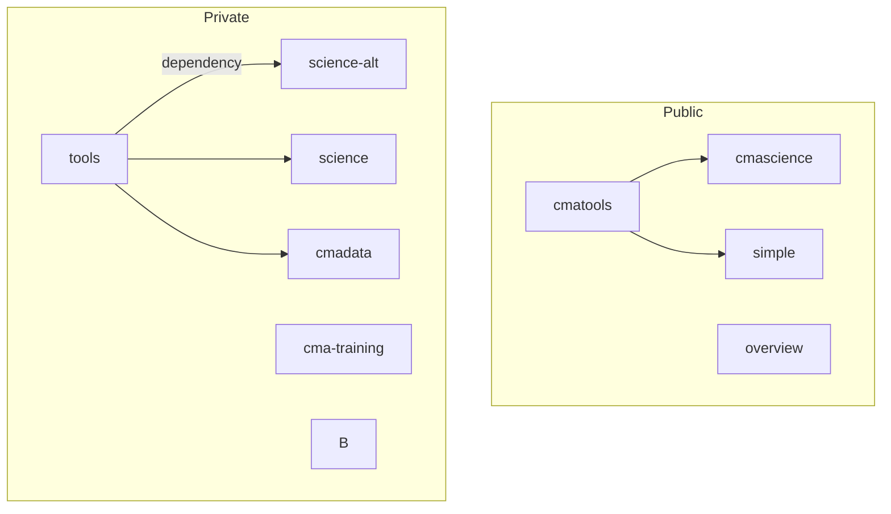

# Overview

Overview repository hosting this readme and content relating to the entire cma-open organisation content

Click links in the chart below to view the repos (subject to permissions for the private repos)

---

Code repo content

overview
- used for 
- independant from other repos
- host development plan in the wiki

cmatools
- used for
- used by 
    - a
    - b 

