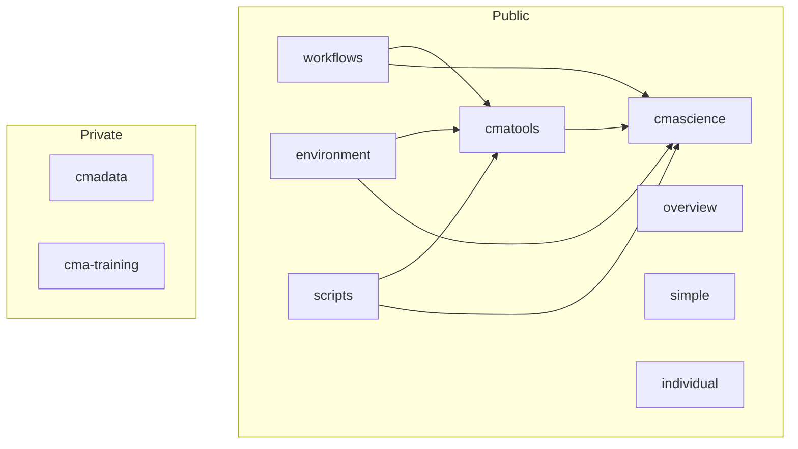

# Overview

Overview repository hosting this readme and content relating to the entire cma-open organisation content

Click links in the chart below to view the repos (subject to permissions for the private repos)

Use of common dependency repos (tools, cmatools) by exemplar projects (both public and private)

---

# Key documents

- Development plan https://github.com/cma-open/overview/wiki/Development-plan
- System requirements advice https://github.com/cma-open/overview/wiki/Software-requirements-(generic)

# Repository list and contents

## Overview

Overview repo  (public)
- https://github.com/cma-open/overview
- used for project planning and organisation overview
- independant from other repos
- host development plan in the wiki

## Key code repos

cmatools repo (TEMPLATE WIP)  (public)
- https://github.com/cma-open/cmatools
- used to illustrate interaction between core and dependency repos (public)
- python package hosting commonly used tools (dependency)
- not for use as an independant package 
- acts as a template (easily create new repos with this structure and starting content)
- used by 
    - cmadata
    - cmascience

cmascience repo (TEMPLATE WIP)  (public)
- https://github.com/cma-open/cmascience
- used to illustrate interaction between core and dependency repos (public)
- mimics a simple science based project package 
- python package (core)
- WIP extend to template

cmadata repo  (private)
- https://github.com/cma-open/cmadata
- used to provide synthetic data for testing or development
- python package (core)
- can be used as an independant package

## Supporting and shared repos

environment repo  (public)
- https://github.com/cma-open/environment
- used to provide shared conda environment to other repos

scripts repo  (public)
- https://github.com/cma-open/scripts
- used to provide shared shell scripts to other repos

workflows repo  (public)
- https://github.com/cma-open/workflows
- used to provide shared action workflows to other repos

## Simple or minimal repos

individual repo (public)
- https://github.com/cma-open/individual
- A basic python package that includes environment management within an individual code repository
- Installable python package (pyproject.toml, no setup.py)
- Simple tests and code example to show high test coverage and code style checks (Codacy, CodeQL, MS Defender)
- Automated testing via GitHub actions workflows
- Virtualenv and dependabot via requirements.txt (not conda)
- Include test bade and link to open repo summary code scores
- No GitHub pages site
- No repo wiki

simple repo (TEMPLATE WIP)  (public)
- https://github.com/cma-open/simple
- mimics a very simple python package 
- allow quick testing and examples of package features
- python package (core)
- within rep conda env file, scripts and workflows
- no links to other repos
- no GitHub pages site, no wiki

## Other repos

cma-training repo  (private)
- https://github.com/cma-open/cma-training
- holds course progress notes
- hosts code snippets
- function, class and module code examples
- (PAUSED) kept as long term reference

---

# Relationships between python package and environment

Two main situations exist.

1. The code in the repo manages the python package and also manages the environment setup and maintenance (conda or venv)
- e.g. 
    - simple
    - individual

2. Code is managed in seperate repos for the particular python package and a seperate code environment
- e.g.
   - cmadata
   - cmascience
   - cmatools

---

Summary - project planning and testing

| repo              |  wiki  | GH pages? | Status |
| ----------------- |  ----- | --------- | ------ |
| overview          |  Yes   |   No      | Stable |
| cma-training      |  No    |   No      | Paused |

---

Summary - code repos

| repo (*) template | main or dependency | wiki     | GH pages? | env name    | env type   | Features   |
| ----------------- | ------------------ | -------- | -------- | ------------ | ---------- | ---------- |
| cmadata (*)       |  dependency        |          |          |              |            |            |
| cmascience (*)    |  dependency        | WIP      |          |              |            |            |
| cmatools (*)      |  dependenc         | Yes      |    Yes   |              |            |            |
|                   |                    |          |          |              |            |            |
| environment       | dependency         |          |          |   check      |            |            | 
| scripts           | dependency         |          |          |              |            |            | 
| workflows         | dependency         |          |          |              |            |            |
|                   |                    |          |          |              |            |            |
| simple (*)        | main               | No       |          | simple-env   | conda      |            |
| individual        | main               | No       |    N     |individual-env| venv       | dependabot |

- (*) = available as a template repo (WIP)
- main = used as an independent python package
- dependency = only used as a dependency to a main package, not used directly
- status = Stable / WIP
    - Stable indicates ready for use and no pending high priority development or bug fixes are required
    - WIP indicates not yet ready for use and high priority new features or bug fixes are still required 

---

Repo status notes

| repo (*) template | Notes              |  Status | Updated   | Open issues | Priority issues |
| ----------------- | ------------------ |  ------ | --------- | ----------- | --------------- |
| cmadata (*)       |  Example data creation repo                     |  Paused    | Dec, 2024 | -  | Low  |
| cmascience (*)    |  Example core repo that uses cmatools           |  WIP    | Dec, 2024 | 18 | High |
| cmatools (*)      |  Example common tools/func/commands, used by core repos |  WIP  | Dec, 2024 | 52  | High |
|                   |                    |         |  |  | |
| environment       | Conda environment files for use by other repos  |  WIP    | Dec, 2024 | - | High |
| scripts           | Shell scripts for use by other repos            |  WIP    | Dec, 2024 | - | High |
| workflows         | Action workflows for use by other repos         |  WIP    | Dec, 2024 | 1 | High |
|                   |                    |         |  |  | |
| simple (*)        | Self-contained repo for quick test development  |  WIP    | Dec, 2024  | 26  | High |
| individual        | Basic repo using venvs not conda                |  Stable |  Dec, 2024 | 9 | Low |
|                   |                    |         |  |  | |
| cma-training      | Couse notes, code examples   |  Paused | Dec, 2024  | 3 | Low |

---

Immediate next steps

- filter down issues and get cmascience working with cmatools
- cmatools issues
    - merge in dev-45-data module PR
    -   
- cmascience issues
    - #23 cli tool for aim 1 
- clearly label some issues in these two repos to work on later
- create and use environment repo
- create and use workflows repo
- create and use scripts repo

New milestone categories accross all repos

1. This Sprint
2. Next Sprint
3. Backlog
4. Parked

