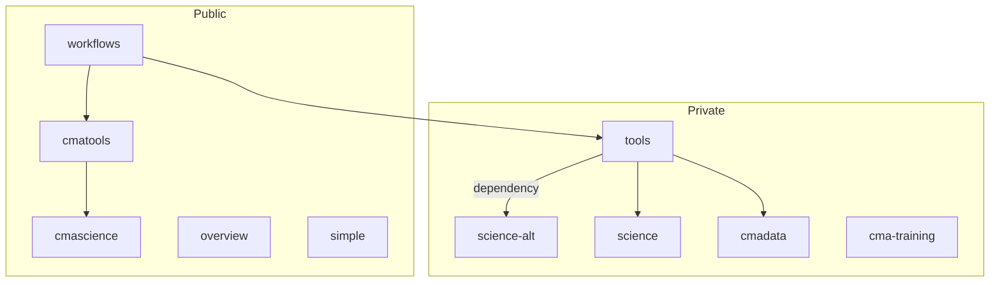

# Overview

Overview repository hosting this readme and content relating to the entire cma-open organisation content

Click links in the chart below to view the repos (subject to permissions for the private repos)

Use of common dependency repos (tools, cmatools) by exemplar projects (both public and private)

---

# Key documents

- Development plan https://github.com/cma-open/overview/wiki/Development-plan
- System requirements advice https://github.com/cma-open/overview/wiki/Software-requirements-(generic)

# Organisation repository list and contents

overview repo
- https://github.com/cma-open/overview
- used for project planning and organisation overview
- independant from other repos
- host development plan in the wiki

workflows repo
- https://github.com/cma-open/workflows
- used to provide shared action workflows to other repos

cma-training repo
- https://github.com/cma-open/cma-training
- used to hold code course progress
- host code snippets
- function, class and module code examples

science-alt repo
- https://github.com/cma-open/science-alt
- used to illustrate interaction between core and dependency repos (private)
- simple python package (core)
- example use only (not for project use)

science repo
- https://github.com/cma-open/science
- used to illustrate interaction between core and dependency repos (private)
- simple python package (core)
- example use only (not for project use)

tools repo
- https://github.com/cma-open/tools
- used to illustrate interaction between core and dependency repos (private)
- simple python package (dependency)
- not for use as an independant package
- example use only (not for project use)

cmatools repo (TEMPLATE WIP)
- https://github.com/cma-open/cmatools
- used to illustrate interaction between core and dependency repos (public)
- python package hosting commonly used tools (dependency)
- not for use as an independant package 
- acts as a template (easily create new repos with this structure and starting content)
- example use only (not for project use)
- (conversion / extend for use by projects - WIP)
- used by 
    - cmadata
    - cmascience
    - camsimple

cmadata repo
- https://github.com/cma-open/cmadata
- used to provide synthetic data for testing or development
- python package (core or dependency)
- can be used as an independant package
- example use only (not for project use)
- (conversion / extend for use by projects - WIP)
- used by
    - WIP 

cmascience repo (TEMPLATE WIP)
- https://github.com/cma-open/cmascience
- used to illustrate interaction between core and dependency repos (public)
- mimics a simple science based project package 
- python package (core)
- WIP extend to template
- example use only (not for project use)
- (conversion / extend for use by projects - WIP)

simple repo (TEMPLATE WIP)
- https://github.com/cma-open/simple
- mimics a very simple python package 
- allow quick testing and examples of package features
- python package (core)
- no GitHub pages site

---

Summary

| repo            | core use        | dependency use  | wiki         | template | GH page? |
| --------------- | --------------- | --------------- | ------------ | -------  | -------- |
| overview        |                 |                 | Yes          |          |          |
| workflows       |                 | Yes             |              |          |          |
| cma-training    |                 |                 |              |          |          |
| science-alt     | Yes             |                 |              |          |          |
| science         | Yes             |                 |              |          |          | 
| tools           |                 | Yes             |              |          |          |
| cmadata         |                 | Yes             |              |  WIP     |          |
| cmascience      |                 | Yes             | WIP          |  WIP     |          |
| cmatools        |                 | Yes             | Yes          |  WIP     |    Yes   |
| simple          | Yes             |                 |              |  WIP     |          |

- core = used as an independnt python package
- dependency = only used as a dependency to a core package

---

