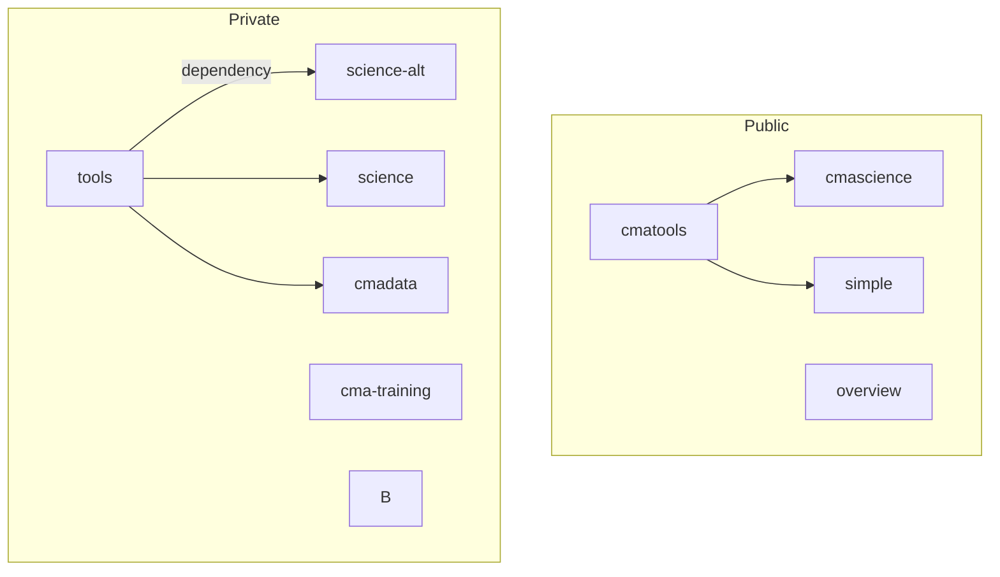

# overview
Overview repo and public pages to highlight organisation content

---

Code repo content

overview
- used for 
- independant from other repos

cmatools
- used for
- used by 
    - a
    - b 

